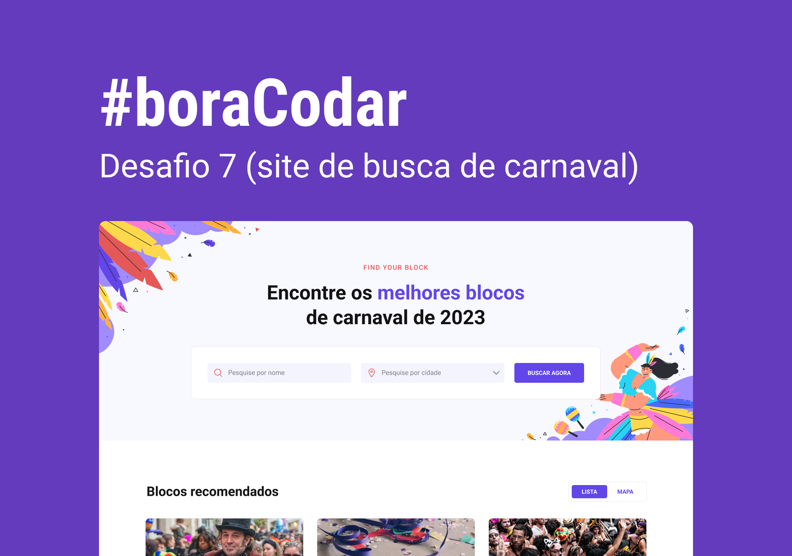

<h1 align="center"> Desafio 7 - Bloco de Carnaval </h1>

  <a href="#-tecnologias">Tecnologias</a>&nbsp;&nbsp;&nbsp;|&nbsp;&nbsp;&nbsp;
  <a href="#-projeto">Projeto</a>&nbsp;&nbsp;&nbsp;|&nbsp;&nbsp;&nbsp;
  <a href="#-layout">Layout</a>&nbsp;&nbsp;&nbsp;|&nbsp;&nbsp;&nbsp;
  <a href="#memo-licença">Licença</a>

  

 

  

## 🚀 Tecnologias

Esse projeto foi desenvolvido com as seguintes tecnologias:

-   HTML e CSS
-   JavaScript
-   Git e Github
-   Figma

## 💻 Projeto

O desafio 8 é uma dashboard que apresenta vários conceitos, principalmente de svg, grid e animações, tudo com CSS

-   [Acesse o projeto finalizado, online](https://lyzzandro.github.io/desafio_7/)

## 🔖 Layout

Você pode visualizar o layout do projeto através [DESSE LINK](https://www.figma.com/community/file/1207675804423978995). É necessário ter conta no [Figma](https://figma.com) para acessá-lo.

## :memo: Licença

Esse projeto está sob a licença MIT.

---

Feito com ♥ by Lyzzandro Dualamo :wave: [Participe da nossa comunidade!](https://discord.gg/rocketseat)